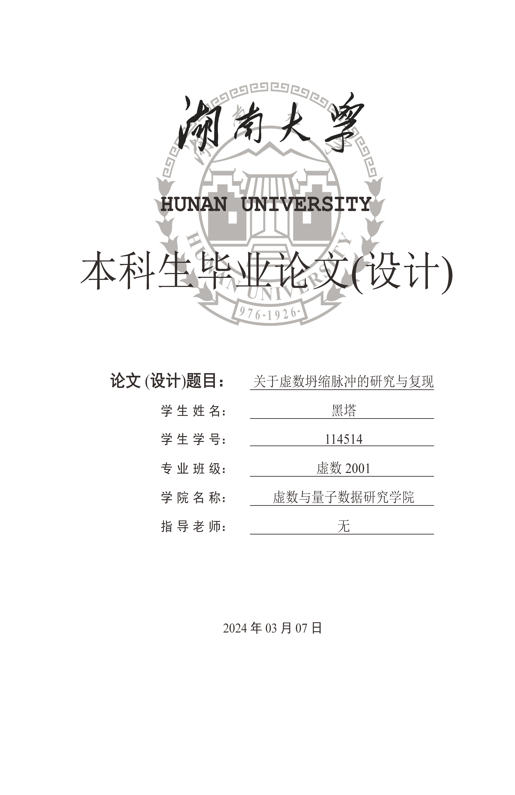
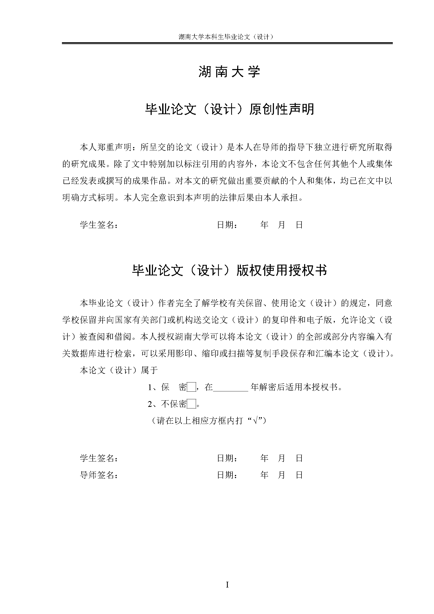
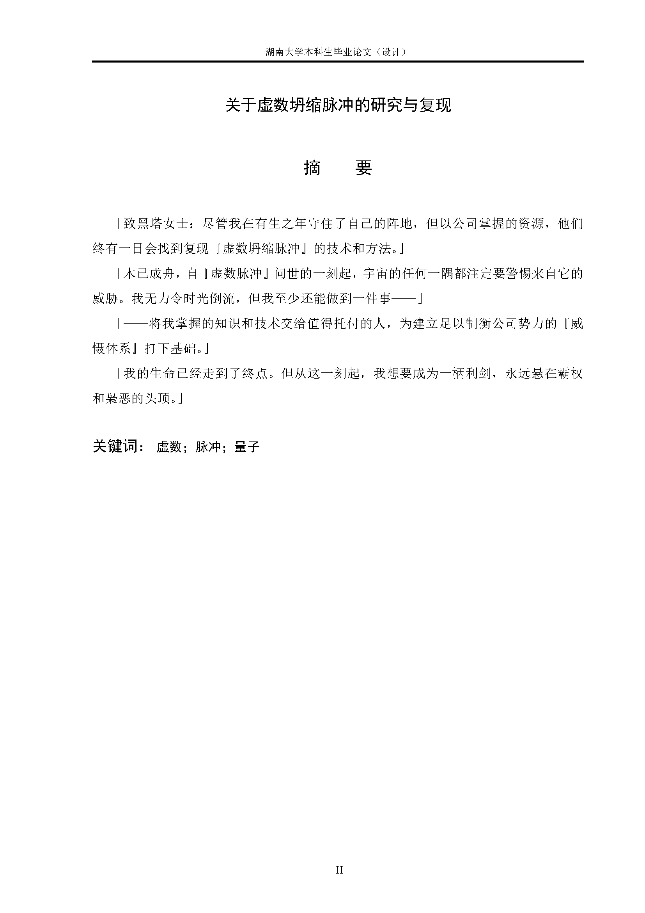
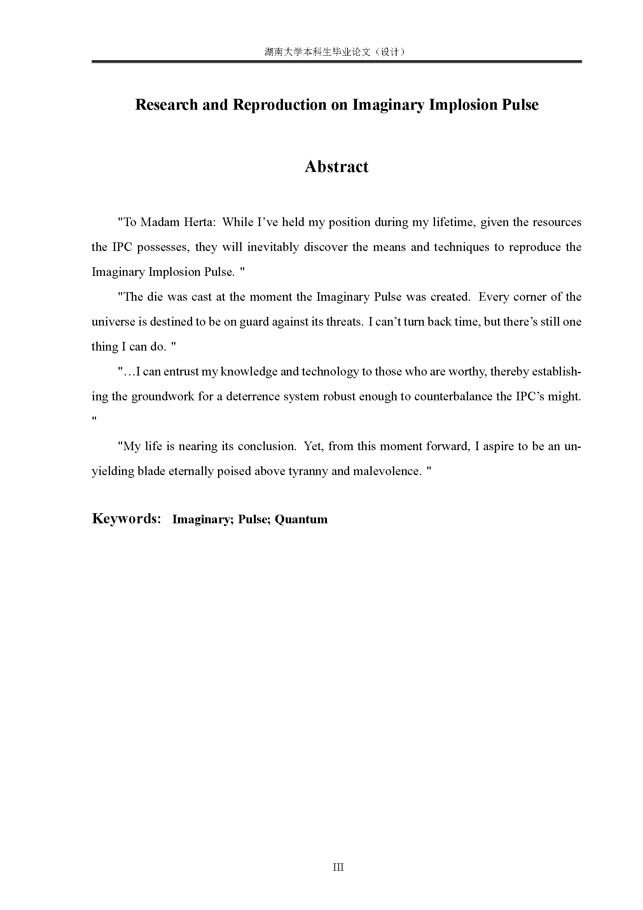
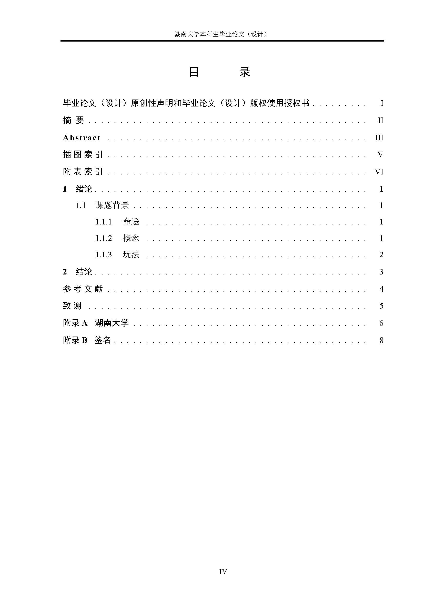
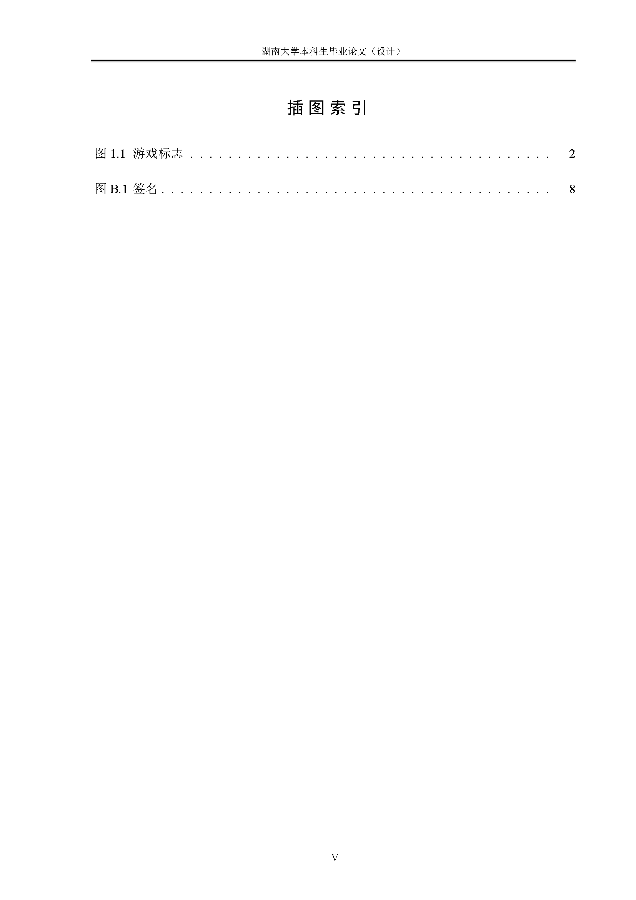
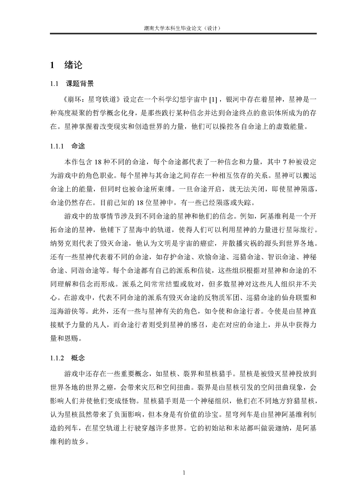
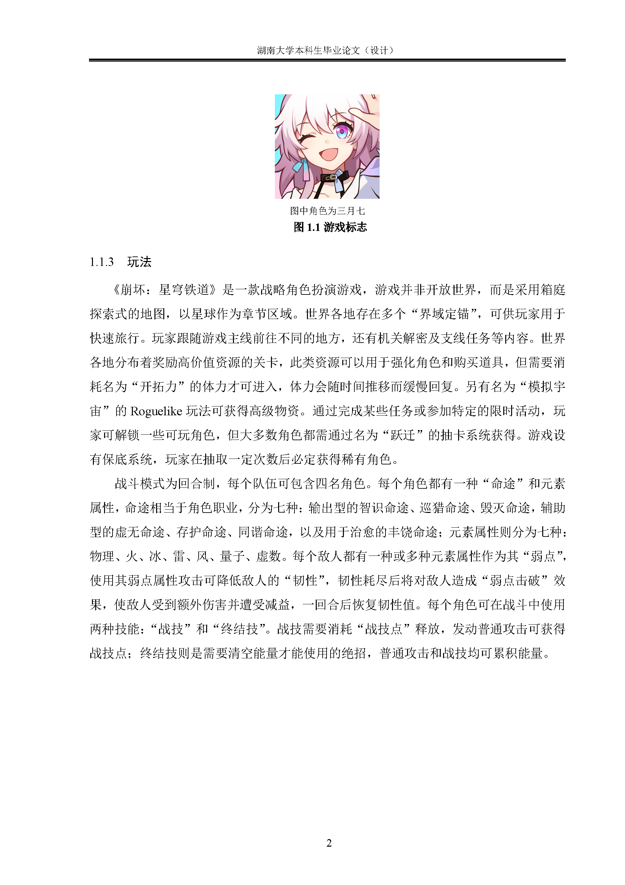

	 <a> 中文 </a> 

# 湖南大学本科毕业论文LaTeX模板（大理类）

## 图例

	
	
	
	
	

## 使用
> TODO

## 开发
* [TeX Live 2024](https://mirrors.tuna.tsinghua.edu.cn/CTAN/systems/texlive/Images/)
* 编译器：XeLaTeX
* IDE：[IntelliJ IDEA Ultimate](https://www.jetbrains.com/zh-cn/idea/) + [TeXiFy IDEA](https://plugins.jetbrains.com/plugin/9473-texify-idea)

## LICENSE
[Apache-2.0](./LICENSE)
