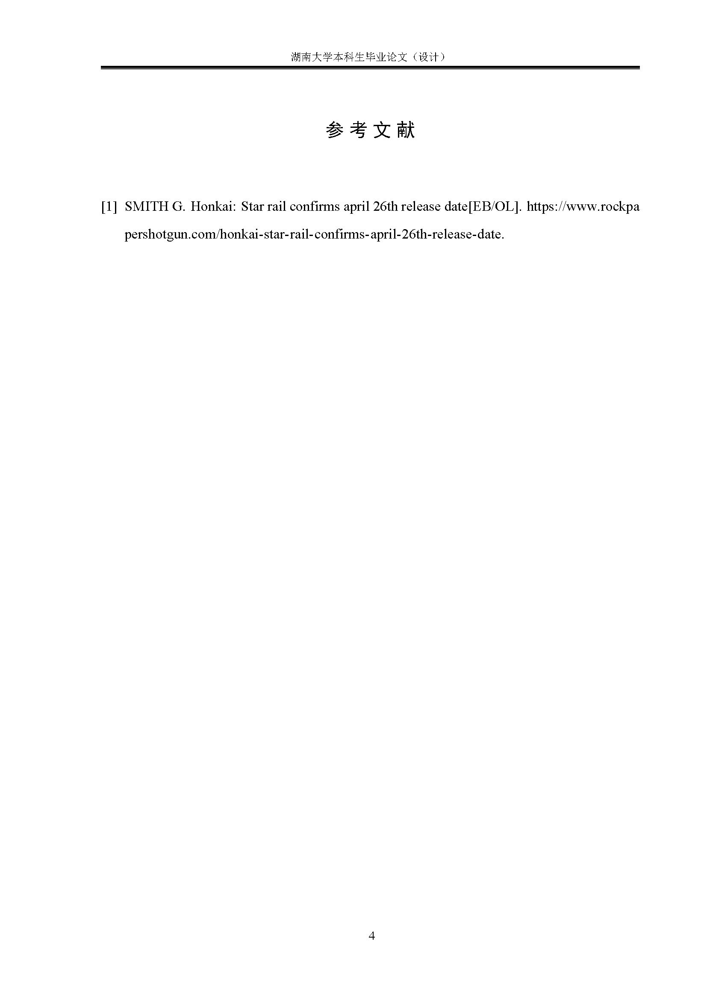
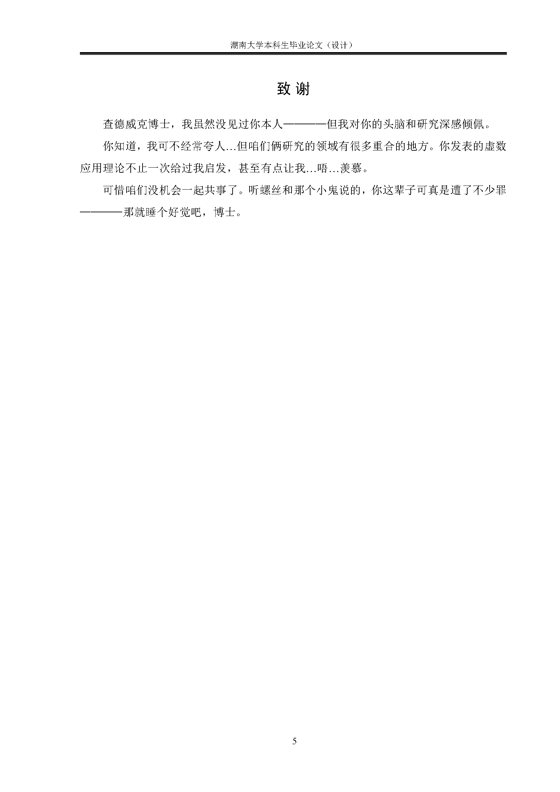
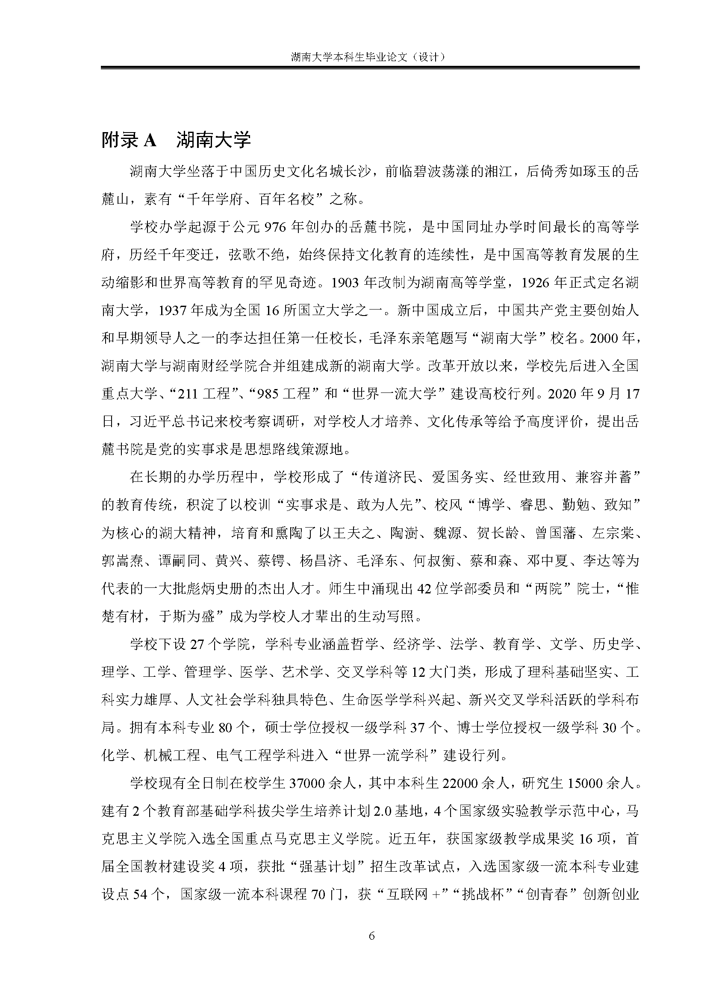
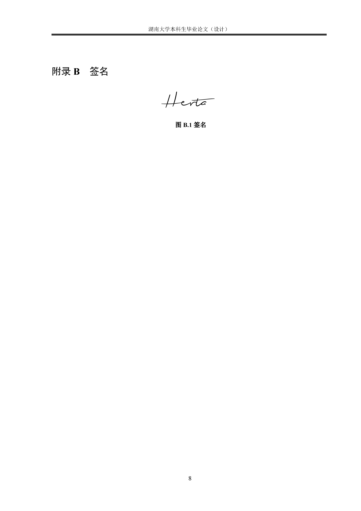

<div align="center">
	<span style="font-weight: bold"> <a> 中文 </a> </span>
</div>

# 湖南大学本科毕业论文LaTeX模板（大理类）
[](./LICENSE)

## 图例
<div align="center">
	
	
	
	
	
</div>

## 使用
### Overleaf（推荐）
> TODO

### 本地
1. 安装[TeX Live 2024](https://mirrors.tuna.tsinghua.edu.cn/CTAN/systems/texlive/Images/)
2. 同步本仓库
```
git clone https://github.com/XayahSuSuSu/Latex-HNUThesisTemplate
```
3. 编译
```
cd Latex-HNUThesisTemplate/src
mkdir ../out
latexmk -xelatex -shell-escape main.tex -output-directory="../out"
```
4. 在`out`中找到`main.pdf`

## 说明
> TODO

## 开发
* [TeX Live 2024](https://mirrors.tuna.tsinghua.edu.cn/CTAN/systems/texlive/Images/)
* 编译器：XeLaTeX
* IDE：[IntelliJ IDEA Ultimate](https://www.jetbrains.com/zh-cn/idea/) + [TeXiFy IDEA](https://plugins.jetbrains.com/plugin/9473-texify-idea)

## LICENSE
[Apache-2.0](./LICENSE)
