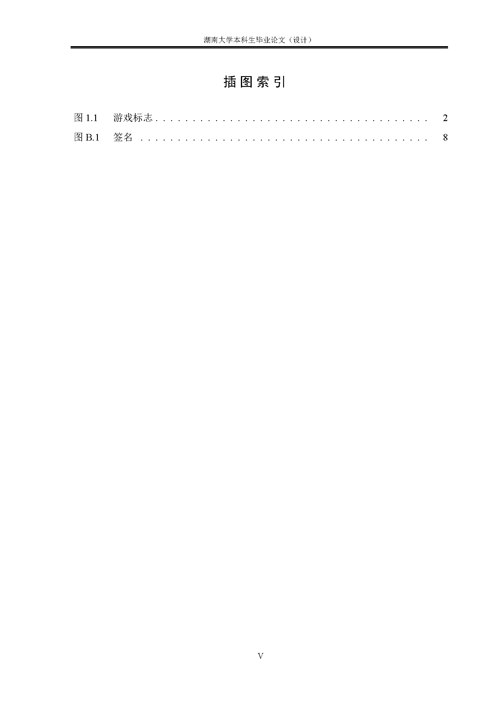
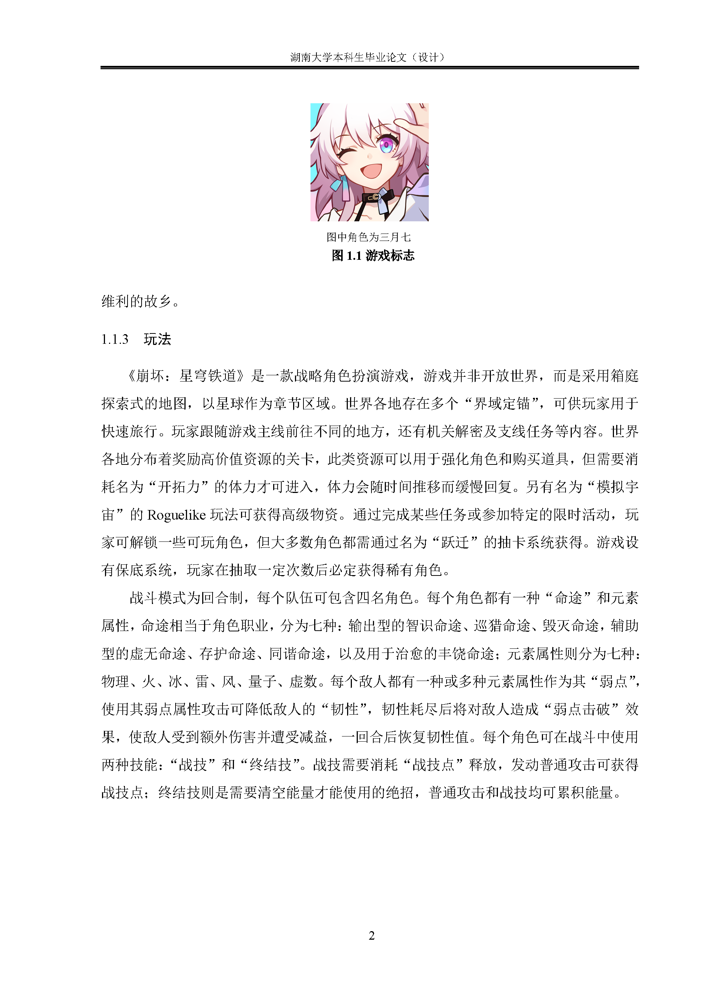
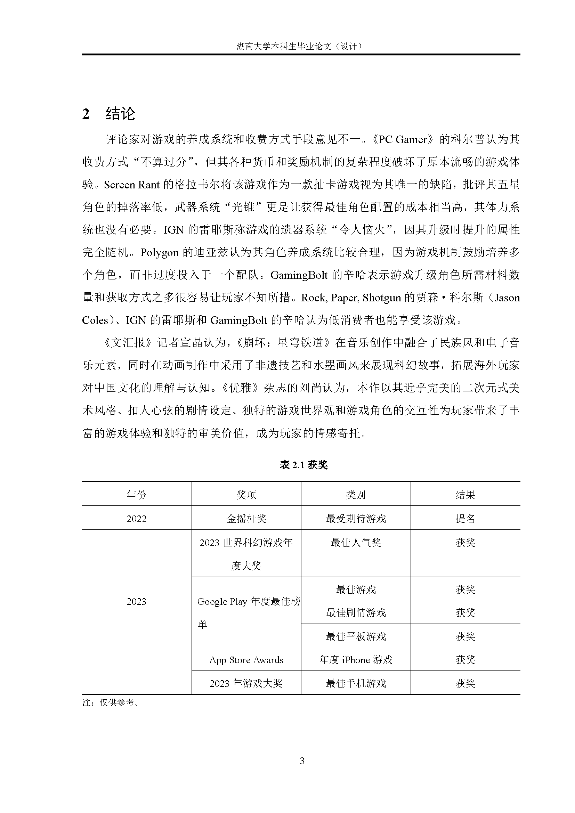
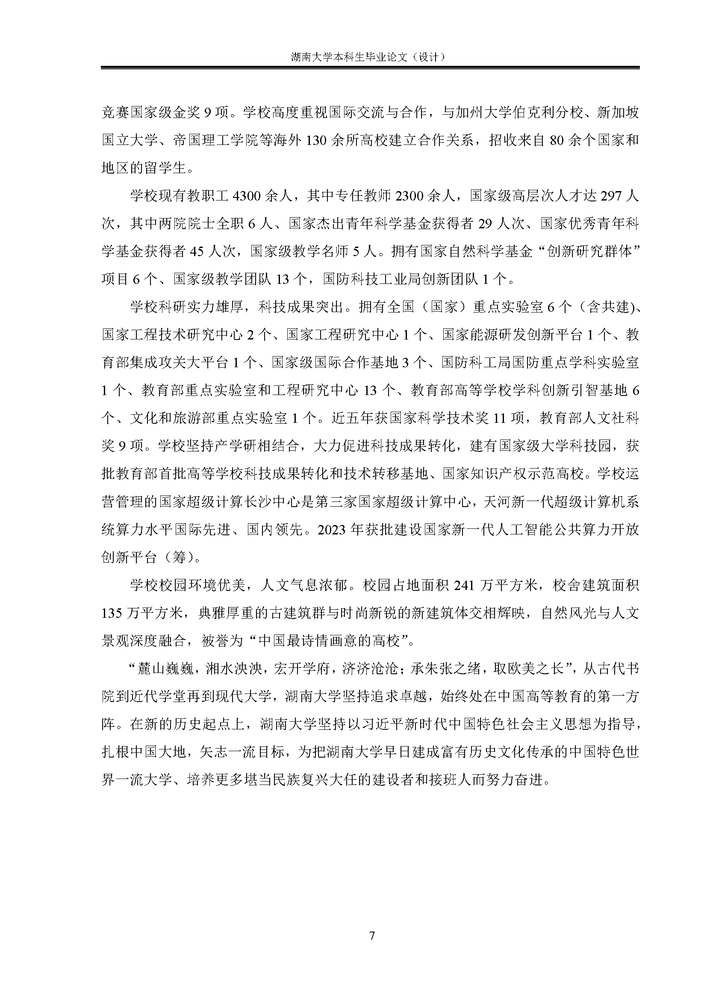

<div align="center">
	<span style="font-weight: bold"> <a> 中文 </a> </span>
</div>

# 湖南大学本科毕业论文LaTeX模板（大理类）
[](./LICENSE)

## 格式
> 本模板像素级遵循[湖南大学2024年撰写规范（大理类）](./specification/撰写规范/撰写规范（大理类）.doc)以及[湖南大学2024年撰写规范样张（大理类）](./specification/撰写规范/撰写规范样张（大理类）.doc)中以下规范内容

| 内容 | 要求 |
| :----: | :----: |
| 论文题目 | 小二号黑体 |
| 章标题 | 三号黑体 |
| 节标题 | 小四号黑体 |
| 条标题 | 小四号黑体 |
| 正文 | 小四号宋体 |
| 页码字体 | 五号宋体 |
| 页码格式 | 绪论至附录用阿拉伯数字连续编排；封面、摘要和目录不编入论文页码；摘要和目录用罗马数字单独编页码 |
| 数字和字母 | Times New Roman |
| 页眉 | 1.5磅加粗、细双线（粗线在上） |
| 页边距 | 上30mm，下25mm，左30mm，右20mm |
| 行间距 | 1.5倍 |
| 中文摘要论文题目 | 小三号黑体 |
| 中文摘要“摘要”字样 | 三号黑体 |
| 中文摘要正文 | 小四号宋体 |
| 中文摘要关键词 | 正文下方空一行，打印“关键词”三字（四号黑体），关键词（小四号黑体） |
| 英文摘要论文题目 | 小三号Times New Roman粗体 |
| 英文摘要“Abstract”字样 | 三号Times New Roman粗体 |
| 英文摘要正文 | 小四号Times New Roman |
| 英文摘要关键词 | 正文下方空一行，打印“关键词”三字（四号Times New Roman粗体），关键词（小四号Times New Roman粗体） |
| 目录 | 序号数字用Times New Roman，一级标题用小四号黑体，其余小四号宋体 |
| 段前段后 | “节”、“条”的段前、段后各设为0.5行 |
| 引用文献 | 编号用阿拉伯数字置于方括号中，用上标的形式置于所引内容最末句的右上角 |
| 表格序号及标题 | 表格上方居中（五号黑体加粗，数字和字母为五号Times New Roman加粗） |
| 表内文字 | 五号宋体 |
| 表底附注 | 小五号宋体 |
| 插图标题 | 五号宋体加粗 |
| 插图注释 | 小五号宋体 |

## 图例
<div align="center">
	
	
	
	
	
	
	
	
</div>

## 使用
### Overleaf（推荐）
> TODO

### 本地
1. 安装[TeX Live 2024](https://mirrors.tuna.tsinghua.edu.cn/CTAN/systems/texlive/Images/)
2. 同步本仓库
```
git clone https://github.com/XayahSuSuSu/Latex-HNUThesisTemplate
```
3. 编译
```
cd Latex-HNUThesisTemplate/src
mkdir ../out
latexmk -xelatex -shell-escape main.tex -output-directory="../out"
```
4. 在`out`中找到`main.pdf`

## 说明
* 1. 通常情况下只需要更改`src/docs/*`、`src/main.tex`、`src/main.tex`即可

* 2. 若封面中的**论文(设计)题目**需要两行显示，可以直接修改`src/pkgs/cover.sty`，去掉`\thesisTitle`相关内容，再手动在表格中添加一行，例如：
```
% ......
{\sizeTwol {
    \fontSimheiBold 论文\fontSimheiBoldChar\hspace{0pt}(\fontSimheiBold 设计\fontSimheiBoldChar)\hspace{0pt}\fontSimheiBold 题目：
}} & {\sizeThreel {
    \fontSimsun\fontTimesNewRoman\underline{\makebox[\contentLength][c]{
        关于虚数坍缩脉冲的研究与
    }}
}} \\
\specialrule{0em}{\contentVerticalSpace}{0pt}
& {\sizeThreel {
    \fontSimsun\fontTimesNewRoman\underline{\makebox[\contentLength][c]{
        复现
    }}
}} \\
\specialrule{0em}{\contentVerticalSpace}{0pt}
{\sizeFour {
    \fontSimhei 学~生~姓~名：
}} & {\sizeThreel {
    \fontSimsun\fontTimesNewRoman\underline{\makebox[\contentLength][c]{
        \studentName
    }}
}}  \\
% ......
```

* 3. 当且仅当`\chapter`与`\section`之间没有段落时，需要使用`\vspace{7pt}`手动调整间距，例如：
```
\chapter{绪论}
\vspace{7pt}


\section{课题背景}
```


## 开发
* [TeX Live 2024](https://mirrors.tuna.tsinghua.edu.cn/CTAN/systems/texlive/Images/)
* 编译器：XeLaTeX
* IDE：[IntelliJ IDEA Ultimate](https://www.jetbrains.com/zh-cn/idea/) + [TeXiFy IDEA](https://plugins.jetbrains.com/plugin/9473-texify-idea)

## LICENSE
[Apache-2.0](./LICENSE)
